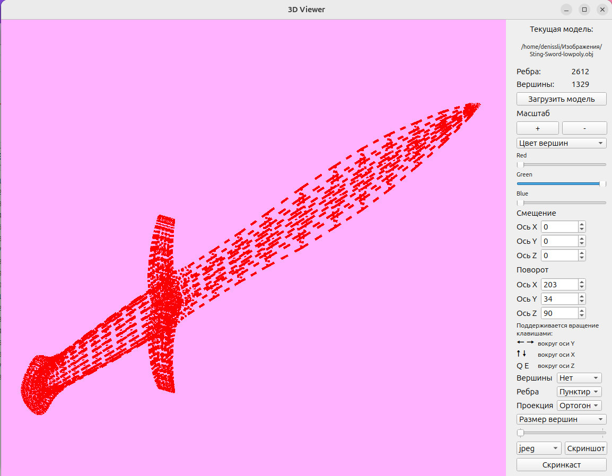
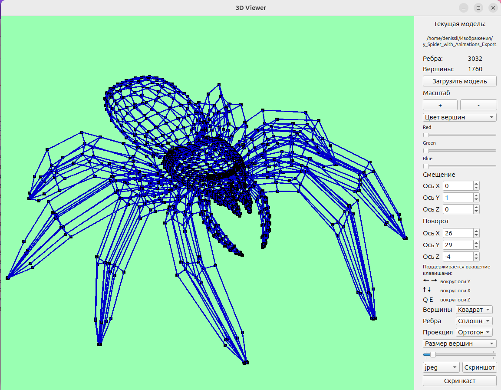
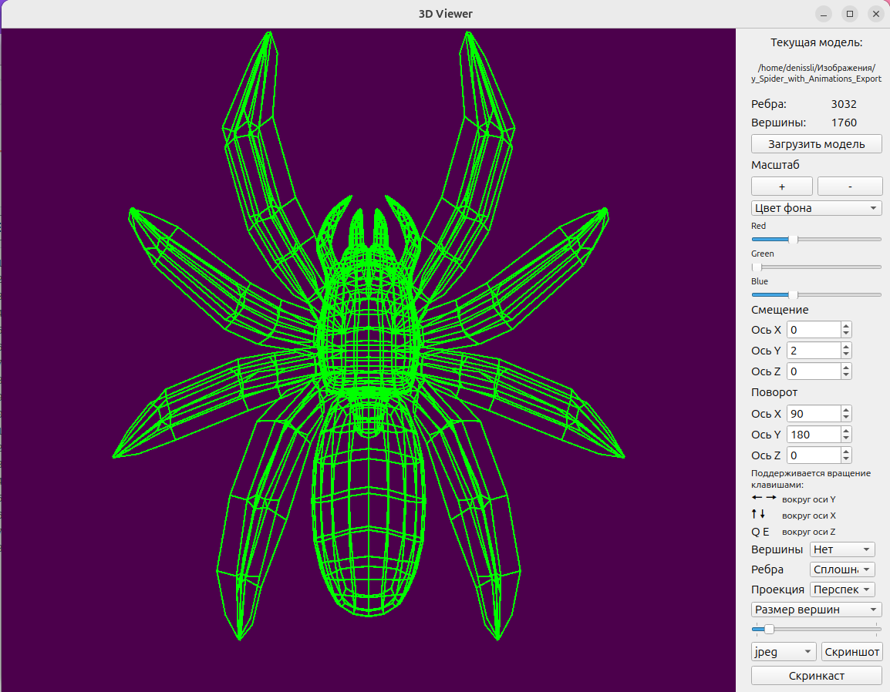

### 3D Viewer
3D model viewer

## Description
The program supports .obj models. 3D objects can be viewed in wireframe mode, it is possible to enable the display of vertices.\
The ability to change the colors of the background, model and vertices is implemented. The program is written in C++, OpenGL and GLM.

## Installation
QT6, libglm and libopengl must be installed\
```cd src && make install```\
Generate docs:\
```cd src && make dvi```\
Run tests:\
```cd src && make tests```

## Examples:







